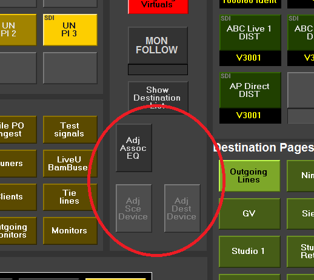

[UI Components](../../index.html)

# Adjust Component

This is a simple control to take either name or index, determine if it's an "adjustable" thing (which means the name exists in "instances.xml" and there is a type handler in "typehandlers.xml" for that type of device)  
You can supply either a name directly or three parameters index, instance and database to look up a router name.  


This example shows three adjust buttons on a router panel driven from source and destination selection

UI is just a single button that is enabled/disabled appropriately depending upon whether the name used is adjustable or not.  
An adjustment name derived from BNCS databases when "index" parameter is supplied is split on # character so that the same instance can appear multiple times with context information appended.

e.g. in dev_xxx.db7

```ini
[Database_7]
...
0383=26/PROC001#1
0384=26/PROC001#2
...
```

both are treated as instance 26/PROC001

This control is optimised for use with connections.

## Commands

### instance
Instance of the device to take router names from

### index
The index number indication the source or destination that this button will be assigned to<br>Index must have database and instance configured too

### database
The source or destination index to retrieve the targeting information from

### name
The instance of a device to be adjusted

This can be used without configuring instance/index/database

## Notifications
None

## Stylesheets
None used
