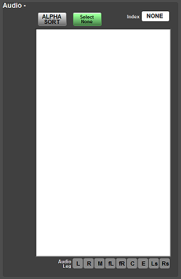

[UI Components](../../../index.html) > [Audio Overview](../../index.html)
# Audio List
A layout configurable source or destination list component for use with mapping buttons on audio router panels.  
Sorting can be alphabetical or by numeric index.

This component was originally developed with a namespace function which allows named grouping of sources or destinations. That functionality has been disabled in this version as it is not required.

## Commands

|Name | Type | Use|
|------|------|------|
|instance | Mandatory | Sets the instance of the router|
|DB_index | Mandatory | Sets the BNCS database number, 0 for sources and 1 for dests|
|DB_index_names | Mandatory | Sets the BNCS database number for names in the listbox|
|DB_index_areas | Unused | Not used|
|DB_audio_leg | Mandatory | Sets the BNCS database number for audio leg information|
|Listed_Namespaces | Unused | Not used|
|Selected_Namespace | Unused |Not used|
|Useable_Legs | Mandatory | A comma deliminated list of the audio legs that can be used in the selection|
|Show_Unused_Ports | Mandatory | If set to false then any source or destination with a blank database name (length of 0 or starts with "N_U_" or contains "---" or "!!!") will not show in the list|
|Alpha_Sorted | Mandatory | If set to true then the source or destination list will be ordered alphabetically otherwise in numerical index order|
|Silence_Index | Mandatory | Sets the index for silence|
|selected | Mandatory Nominal at runtime | Controls the selected index Valid options are "next", "previous" or "none" and will action that selection in the listbox|

## Commands

|Name | Use|
|------|------|
|selected=next|Select the next item in the list|
|selected=previous |Select the previous item in the list|
|selected=none |Deselect the item in the list|

## Notifications

|Name | Use|
|------|------|
|index=&lt;Router Index&gt;|currently selected index or 0 if nothing is selected|

## Developer Notes
Timers are used after values are set to allow the component to load correctly with all parameters present 
