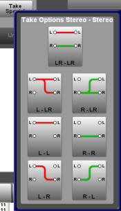

[UI Components](../../../index.html) > [Audio Overview](../../index.html)
# Audio Take Component

## Description

This is a custom take component to route mono, stereo or surround (5.1) audio.

This actually uses age-old BNCS principles of "route with mask" where the mask defines how the route should be made. You'll see various references to "mask" in the code for this reason.

This is the default presentation (with source and destination values having been set to "5.1" sources.


...and this a sample set of "Take Special" options:



This control uses router databases to determine whether a source/destination is mono, stereo, 5.1 or 7/8.

This control does not make routes itself, but it does provide a "take" event for other controls to make routes.

Note: This control works with global destination numbers. The instance (and lock instance) supplied defined the base infodriver number from which the appropriate device number is calculated. In practice this is an easy calculation

```
device = base_device + ( global_dest / 4096 );
destination = global_dest % 4096
```

This control is optimised for use with UI "connections".

## Commands

|Name|Type|Use|
|-------------|--------|---------------------|
|instance|mandatory|Instance of the device to take router source names from<br>This is also used to determine the destination device which is calculated as above
|lock_instance|optional|The base instance of the device to get lock information from. If it isn't supplied then the take button is always enabled with valid source/dest/take mode.<br>This isn't an absolute device - device number is determined by the current destination|
|global_dest|runtime|The global destination index - this is used to put the router dest name in the pre-select label|
|source|runtime|The source index - this is used to put the router source name in the pre-select label|

## Notifications

|Name|Use|
|---------------------------------------|---------------------------------------|
|take.<global_dest_index.<mask>=<source>|when the take button is pressed<br><global_dest_index> is the global dest index<br><mask> is "how" to make the route for the given indices<br><source> is the source index|
|undo|when the undo button is pressed|

## Stylesheets

|Name|Use|
|-------------|--------------------------------------------------------------|
|dest_selected|Shown on the dest pre-select tally when the destination is set|
|dest_deselected|When the destination is not set|
|source_selected|Shown on the source pre-select tally when the source is set|
|source_deselected|When the source is not set|
|takeBackground|Background to the take button|
|groupbox|background to the control|

## Developers Notes

Internally the control makes consistent use of the "mask" - so that the value passed as "mask" is also the name of the buttons on the popup window.
