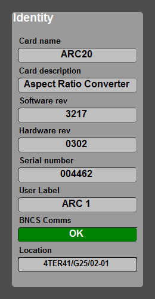

[UI Components](../../index.html)

# Axon Identity Component

## Description

This is a read only display of the common identification parameters for any Axon Synapse card.

The image below shows an example of the component in use:

The component displays the following fields:

* Card Name - as reported by the "Card name" parameter
* Card Description - as reported by the "Card description" parameter
* Software Revision - as reported by the "Software rev" parameter
* Hardware Revision - as reported by the "Hardware rev" parameter
* Serial Number - as reported by the "Serial number" parameter
* User Label - as reported by the "User label" parameter
* BNCS Comms - displays current comms status (OK or Fail)
* Location - displays the location attribute of the card instance to which the component has been targeted

This control is optimised for use with UI "connections".

## Commands

Name     | Type      | Use
---------|-----------|-----------------------------------
instance | mandatory | Instance of the device to be shown

## Notifications

None

## Stylesheets

Name        | Use
------------|-----------------------------------------------
paramlabel	| style for parameter name labels
groupbox	| background to the control
enum_alarm	| shown on the BNCS Comms labels in "Fail" state
enum_ok	    | shown on the BNCS Comms labels in "OK" state

## Developers Notes

All parameters should be present in the devicetype.xml file for each Axon Synapse card.