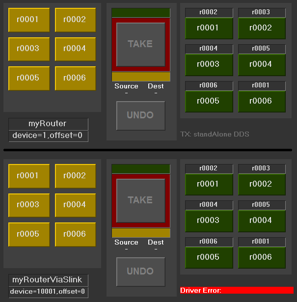

# deviceStatus Component

Show/monitor workstations that are running this BNCS device

The example above shows two instances of the same UI. This component is bottom right of each.

The upper one says: "TX: standAlone DDS" which indicates that this driver is running on a workstation of that name.

The lower one says "Driver Error" because there is no workstation hosting this device. This flags to the user that, even though the buttons have tallys, this device is broken. 

## Commands

### instance
This component requires the instance name "deviceStatus" to be the BNCS device ID of CSI's internal device status infodriver.

## Notifications
None

## Stylesheets
enum_alarm
background_discrete