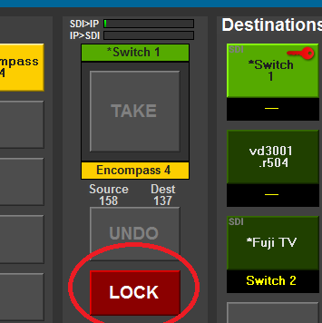

[UI Components](../../index.html)
# Lock Component

This is a simple control to set and show lock.

The control takes instance and index and displays the current lock state (using the stylesheet entries below). On pressing the button on this control the lock state is toggled. "Locked" state simply means an infodriver slot with a 0 or 1 in it.

## Commands
|Name | Use |
|------------|----------------|
|instance | Normal instance targeting|
|index | The index on the lock device|

## Notifications

None

## Stylesheets

|Name | Use |
|------------|----------------|
|enum_unknown | When a control is targeted but the value has not been returned from the device|
|dest_locked | When the destination is locked (1)|
|dest_unlocked | When the destination is not locked (0)|
