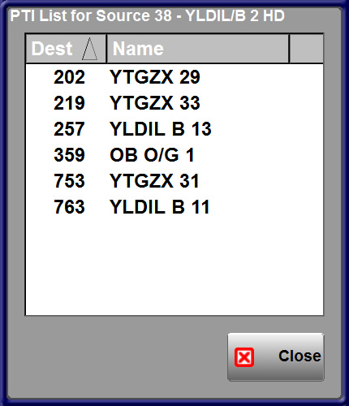
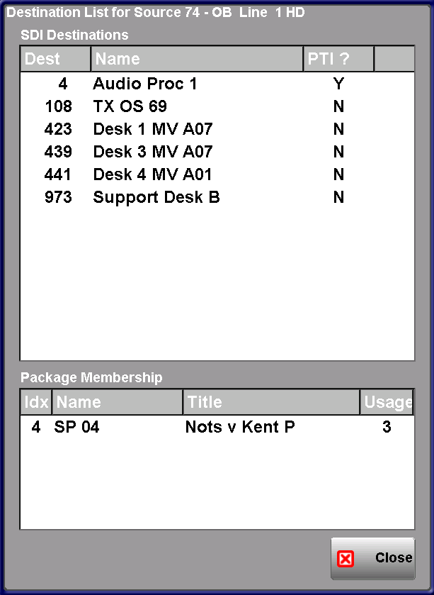

[UI Components](../../index.html)
# Router PTI Component

## Description
This is a router PTI component to show which destinations the selected source is currently routed to.
When the PTI button on the router panel is pressed a popup dialog shows the index and name of the selected source and a list of destinations to which the source is routed:

The listview can be sorted in Index or Name order by pressing on the column headers.  
If the current source is replaced by another source on a destination that is in the list while the list is visible the item will be removed from the list.  Similarly if the source is routed to a new destination while the list is visible this new destination will be added to the list.  
If a destination is a wrapped resource (i.e. it's output is re-presented back on to the matrix as a source, then the PTI? column will contain a "Y", otheriwse an "N". If the column contains "Y", then clicking anywhere on that row will re-target the PTI component with the index of the wrapped resource output, thereby facilitating a step by step forward trace.  
If the component is given the design-time parameter of a packager instance, then it will display additional information about which Source Packages the SDI source index is used in. Each Package will appear on a seperate row, with the hard and soft names displayed, along with a PTI count of Source Package usage

This control is optimised for use with UI "connections".
## Commands
|Name|Type|Use|
|------|------|------|
|instance | mandatory | Instance of the router device to register for crosspoint changes 
|source=<source_index> | run-time method | The source index   e.g.  source=38
|packager_instance | optional | Controls the appearance of the popup panel (as above).  If instance is invalid (or blank), then the plain PTI popup will display 

## Notifications
There are no notifications from this component.
## Stylesheets
|Name|Use|
|------|------|
|groupbox | used on the main group of the popup to show the index and name of the source
|listbox_default| used by the listview control to show the list of destinations

## Developers Notes
The PTI button is a single control that fills the main layout of the component and the stretch option can be used to change the size of the button as required.

The forward trace uses the dest adjust database (7) to calculate the instance name of a corresponding source. It supports multi-output devices e.g. 32/SHUF005#1 by stripping the #1. 
 