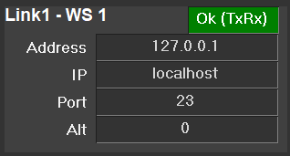

# slinkNetStatus Component

## Description
This is component to show slinkClient connection status via NetStatus messages

## Commands

### instance
Instance of the device that is the first device and redundancy master for this link

### name
The name to use on the UI (this has no other purpose)

### workstation
Where this link is running since there can be multiple hosts and there is no concept of txrx state with NS messages

## Notifications
None

## Stylesheets

Pretty self-explanatory I hope for connection state. Warning is used for rxonly

enum_alarm
enum_warning
enum_ok
paramlabelH
groupbox