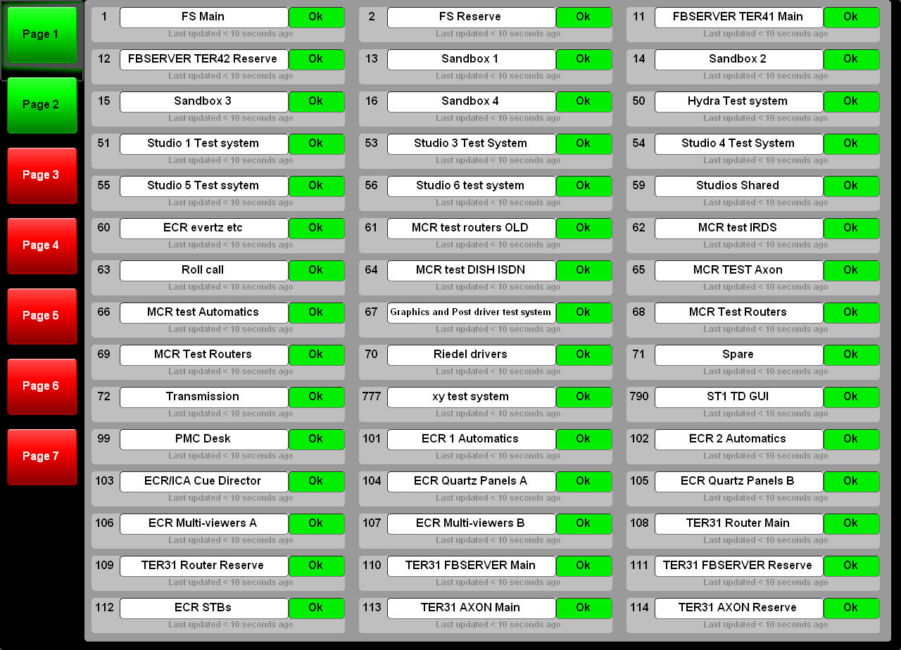

# Status Monitoring - Workstations

## Description
This is a top level panel that reads V4.5 workstation configuration and displays Ok/Fail status for listed workstations.



##Configuration
This panel and its components requires the minimum amount of configuration.

The top level panel uses two components:

* page - page buttons, independently aggregates status into single ok/fail indication
* statusWsMon - display of a single workstation name and status
Both of these components are documented separately.

This application reads workstations.xml (standard V4.5 configuration file) and targets both the page components and the first page of individual workstation components (statusMonWs).

Selecting a new page retargets the individual workstation components.

To work, this top level panel requires that the page controls are called:

```
page_n
```

where n is the page number.

Each workstation component is called:

```
ws_n
```

where n is the button number

This UI determines for itself how many workstation / page buttons there are to ensure that the paging works.

## Ignored Workstations
The configuration file worksations.xml is a pretty good place to get workstation information from....but there may be additional workstations that are development/test machines that you would not expect to see on a live system.

These can be manually excluded by using the design-time setting shown here:


Simply add a comma delimited list of the workstations that you want to exclude. This may also include ranges, for example:

```
1,2,100-200,999
```

excludes workstation 1, and 2, the entire range between 100 and 200 inclusive and workstation 999.

This field is hidden when the panel is run.

## Stylesheets
Name     | Use
---------|----------------------
groupbox | background to the control

## Dependencies
This UI uses the image:

```
/images/tab.png
```

This UI requires the following external panel projects (subdirectories of this project):

[./statusMonWs](../statusMonWs/docs/statusMonWs.html)
[./page](../page/docs/page.html)
