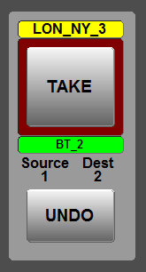

[UI Components](../../index.html)
# Take Component

## Description
This is a simple control to show take sources and destinations and provide take and undo events for another component to make routes. It doesn't make any routes itself.

There is "lock" inhibit - which disables the lock button when the destination is locked. Lock is simply a 0 or 1 in a slot directly corresponding to the destination number. When targeted with instance and index this control goes off and polls for the lock state.

Undo is only available immediately after pressing the take button and disables when the next index value is set.

## Commands

|Name|Use|
|---|--------------------------|
|instance|Instance of the device to take router names from|
|dest|The destination index - this is used to put the router dest name in the pre-select label|
|source|The source index - this is used to put the router source name in the pre-select label|
|lock_instance|The instance of the device to get lock information from|

## Notifications

|Name|Use|
|---|---|
|take.&lt;dest_index&gt;=&lt;source_index&gt;|when the take button is pressed|
|undo|when the undo button is pressed|

## Stylesheets

Name              | Use
------------------|------------------------------------------------------
dest_selected     | Shown on the dest pre-select tally when the destination is set
dest_deselected   | When the destination is not set
source_selected   | Shown on the source pre-select tally when the source is set
source_deselected | When the source is not set
takeBackground    | Background to the take button
groupbox          | background to the control
take_preset       | Style of the source/dest names
take_index        | Style of the source/dest index

## Version History
|Version|Notes|
|--|--|
1.0.0.1 | First release from core
1.0.1.0 | Changes style of source/dest index