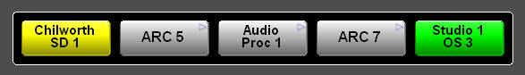

[UI Components](../../index.html)
# Tracebar Component

This is a control that can trace a route back through a system between different routers to form a visual chain.  



The example above shows "Studio 1 OS3" has ARC 7 routed to it, ARC7 then has Audio Proc 1 routed to it etc. etc. The original source of the whole chain is "Chilworth SD1".  
There is no wire-by-wire connection configuration required to use this control - a "connection" is defined as where the source name on one router appears as the destination name on another. The configuration that is required is simply a list of routers that this router may have connections to - see below.

## Commands
Name=default | Use
-------------|---------------------------------------------
instance=    | Instance of the device that is the root (right hand button) of the tracebar
dest=        | The destination index to trace from - this is taken as the root (right hand button) of the tracebar
source=      | The source index to trace from - this is taken as the root (right hand button) of the tracebar
panel=       | Specifies the panel (including the .bncs_ui extension) to load.
stylesheet.unused=default         | &nbsp;
stylesheet.source=source_selected | &nbsp;
stylesheet.route=default          | &nbsp;
stylesheet.destination=dest_selected | &nbsp;
readonly=false | setting this value to true changes the buttons on the tracebar to labels
dynamic=false  | setting this value to true allows the control to dynamically update if any part of the chain it's displaying changes

## Notifications
None

## Stylesheets
Name          |Use
----------------|----------------------------------------------------
dest_selected   | Shown on destination buttons usually the right-most button
source_selected | Shown on source buttons - usually the left-most button (if this control is tracing back from a source then this will be used for the right-most button also)
default         | &nbsp;

Intermediate steps in the route, or unused buttons

## Resources
This control can use the pixmap "/panels/images/navigateAvailable.png" to decorate controls that can be used to navigate to other UIs.

## Configuration
The following section (or something like it!) is required in object_settings.xml
``` xml
<object id="TraceBar">
  <setting id="Index_001" value="121,71,72,122,123,124,125,126,127,128,552" />
  <setting id="Index_002" value="122,71,72,121,123,124,125,126,127,128,552" /> 
  <setting id="Index_003" value="123,71,72,121,122,124,125,126,127,128,552" /> 
  <setting id="Index_004" value="124,71,72,121,122,123,125,126,127,128,552" /> 
  <setting id="Index_005" value="125,71,72,121,122,123,124,126,127,128,552" /> 
  <setting id="Index_006" value="126,71,72,121,122,123,124,126,127,128,552" /> 
  <setting id="Index_007" value="127,71,72,121,122,123,124,125,126,128,552" /> 
  <setting id="Index_008" value="128,71,72,121,122,123,124,125,126,127,552" /> 
  <setting id="Index_009" value="552,71,72,121,122,123,124,125,126,127,128,751,761" /> 
</object>
```

The id of each line is a consecutive sequence of "Index_xxx" numbers - reading the entry stops when the sequence is broken.  
Each entry is a comma delimited list of router device numbers - the first of which defines the starting point for a route. For example for a destination on device 121 this control will look for a route (matching names) on device 71, then 72, then 122, 123, 124, 125,126,127,128,552.